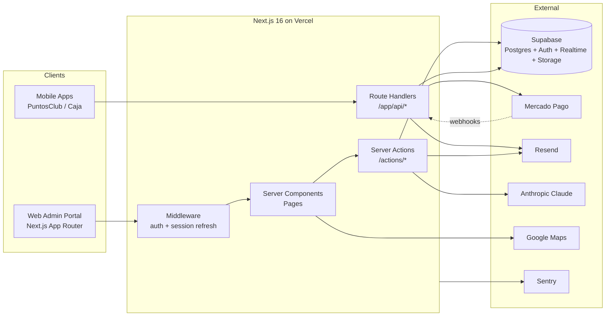
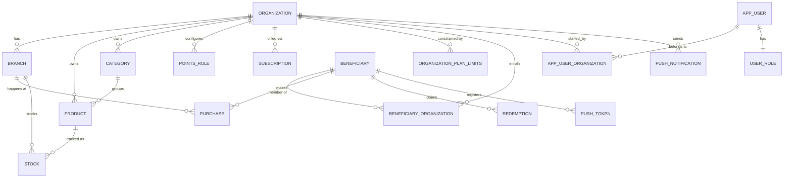
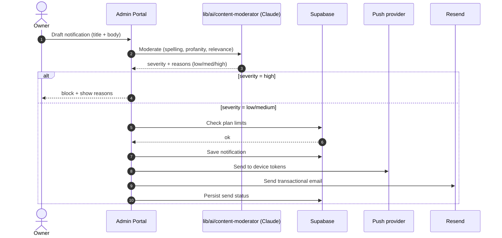
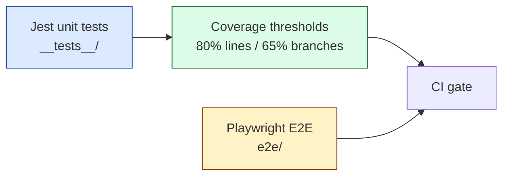

# Puntos Club — Admin Portal

> Multi-tenant **loyalty rewards SaaS** for Argentine retailers. Businesses run their own points programs: customers earn points on purchases and redeem them for rewards, all coordinated through this admin portal.

This repository hosts the **web admin portal** consumed by business owners, store managers, and cashiers. End customers (beneficiaries) interact with the platform via separate mobile apps that talk to this backend through public API routes.

---

## Table of Contents

1. [What this project does](#what-this-project-does)
2. [Tech stack](#tech-stack)
3. [High-level architecture](#high-level-architecture)
4. [Domain model](#domain-model)
5. [Repository layout](#repository-layout)
6. [Authentication & multi-tenancy](#authentication--multi-tenancy)
7. [Server actions vs API routes](#server-actions-vs-api-routes)
8. [Notifications & AI moderation](#notifications--ai-moderation)
9. [Subscriptions & billing](#subscriptions--billing)
10. [Local setup](#local-setup)
11. [Environment variables](#environment-variables)
12. [Scripts](#scripts)
13. [Testing](#testing)
14. [Observability](#observability)
15. [Conventions & gotchas](#conventions--gotchas)

---

## What this project does

Puntos Club is a SaaS platform where each retailer (an **organization**) runs their own customer loyalty program. The admin portal is the operational cockpit for that program.

**Who uses it**

| Role | Where | What they do |
|---|---|---|
| `admin` | This portal | Cross-org platform administration |
| `owner` | This portal | Manages a single organization end-to-end |
| `collaborator` | This portal | Limited operational access (products, purchases) |
| `cashier` | This portal / POS | Records sales, processes redemptions |
| `final_user` (beneficiary) | Mobile app | Earns points, redeems rewards |

**Core capabilities**

- Organization, branch (store location), product, and category catalogs
- Beneficiary (customer) management — including customers shared across organizations
- Purchase recording with automatic point calculation
- Redemption workflow (customer redeems points → cashier confirms → stock decrements)
- Configurable **points rules** (earn/redeem ratios, multipliers)
- Stock tracking with realtime updates
- **Push + email notification campaigns** with **AI content moderation** (Claude)
- Subscription billing via **Mercado Pago** (trial / advance / pro tiers, with per-plan feature limits)
- Analytics dashboards: revenue, member growth, points economy, branch performance, top products
- Granular role-based permissions (per entity, per action: view/create/edit/delete)
- Multi-step onboarding wizard for new organization owners
- Spanish (Argentina) and English UI

---

## Tech stack

| Concern | Tool |
|---|---|
| Framework | **Next.js 16** (App Router, React Server Components) |
| Language | **TypeScript** (strict) |
| UI | **React 19**, **Tailwind CSS 4**, **shadcn/ui** (Radix), **Lucide** icons, **next-themes** |
| Database / Auth | **Supabase** (Postgres 17, Auth, Realtime, Storage) |
| Server-side data | Server Components + Server Actions; service-role admin client for privileged ops |
| i18n | **next-intl** (`es` / `en`) |
| Validation | **Zod** schemas in `/schemas` |
| Payments | **Mercado Pago** (subscriptions / preapproval) |
| Email | **Resend** (transactional) |
| AI | **Anthropic Claude** SDK — content moderation for push notifications |
| Maps | **Google Maps JS API** + reCAPTCHA v3 |
| Charts | **Recharts** |
| 3D / Animation | **Three.js**, **@react-three/fiber**, **@react-three/drei**, **GSAP** (landing) |
| QR codes | `qrcode.react` |
| Tests | **Jest** (unit/integration, jsdom), **Playwright** (E2E) |
| Quality | **ESLint**, **Knip** (dead code), **react-doctor** |
| Monitoring | **Sentry** + **Vercel Analytics** + **Speed Insights** |
| Hosting | **Vercel** |

---

## High-level architecture



**Request flow on the web portal**

1. Browser hits a `/dashboard/*` route.
2. Middleware (`lib/supabase/middleware.ts`) refreshes the Supabase session cookie and redirects to `/auth/login` if unauthenticated.
3. The Server Component fetches data through a **server-side Supabase client** (`lib/supabase/server.ts`), automatically scoped to the user's active organization (see [multi-tenancy](#authentication--multi-tenancy)).
4. Mutations are submitted through **Server Actions** in `/actions/*`, which validate with Zod, persist via Supabase, and `revalidatePath()` the relevant routes.

---

## Domain model



**Key entities**

- **Organization** — a tenant. Almost every other table has an `organization_id` and is RLS-scoped to it.
- **Beneficiary** — a customer. Can belong to multiple organizations through the `beneficiary_organization` junction.
- **Purchase / Redemption** — the two sides of the points economy. Purchases earn points; redemptions spend them.
- **Points Rule** — configurable formula deciding how many points a purchase awards or a redemption costs.
- **Plan Limits** — per-plan caps on features (e.g., notifications/day, max users, max products), enforced before mutations.
- **Push Notification** — a campaign with `title`, `body`, target audience; goes through AI moderation before send.

---

## Repository layout

```
.
├── app/                       # Next.js App Router
│   ├── (auth)/                #   Login, password reset, callbacks
│   ├── owner/onboarding/      #   New-org wizard (public)
│   ├── mobile-apps/           #   Mobile download landing
│   ├── dashboard/             #   Protected admin portal
│   │   ├── organization/
│   │   ├── beneficiary/
│   │   ├── branch/
│   │   ├── product/
│   │   ├── category/
│   │   ├── purchase/
│   │   ├── redemption/
│   │   ├── stock/
│   │   ├── push_notifications/
│   │   ├── points-rules/
│   │   ├── subscription/
│   │   ├── settings/
│   │   └── …                  #   ~20 feature areas, all CRUD
│   └── api/                   # Route handlers (mobile + webhooks)
│       ├── purchase/
│       ├── beneficiary/
│       ├── notifications/
│       ├── mercadopago/
│       └── monitoring/        #   Sentry tunnel
├── actions/                   # Server Actions (web mutations)
├── components/                # UI: dashboard/, onboarding/, landing/, ui/ (shadcn)
├── lib/
│   ├── auth/                  # getCurrentUser, permissions, getActiveOrgIdFilter
│   ├── supabase/              # client / server / admin / middleware
│   ├── ai/                    # Claude content moderator
│   └── …
├── schemas/                   # Zod schemas per entity
├── types/                     # Shared TS types + supabase.ts (generated)
├── hooks/                     # Custom React hooks
├── i18n/                      # next-intl request config
├── messages/                  # es.json / en.json
├── supabase/
│   ├── migrations/            # 22+ SQL migrations
│   └── config.toml            # Local Supabase config
├── __tests__/                 # Jest tests
├── e2e/                       # Playwright tests
├── scripts/                   # tsx-runnable scripts (seed, MP setup)
└── public/
```

---

## Authentication & multi-tenancy

Auth is handled by **Supabase Auth** (email + password). The cookie session is refreshed by middleware on every request.

**Multi-tenancy is enforced at two layers:**

1. **Postgres RLS policies** — every tenant-scoped table has an `organization_id` and policies that match the calling user's org membership.
2. **Active-org cookie scoping in app code** — a logged-in user can belong to multiple orgs (or be a platform admin). To pick which org they're acting in, the portal stores `active_org_id` in a cookie. Server-side queries are filtered through the central helper `getActiveOrgIdFilter()`:

   ```mermaid
   flowchart TD
       Q[Server Component / Action]
       Q --> H[getActiveOrgIdFilter]
       H --> R{Role?}
       R -->|admin| ALL[returns null<br/>no filter — sees all orgs]
       R -->|owner / collaborator / cashier| C[reads active_org_id cookie<br/>fallback: user.organization_id]
       C --> F[returns org id<br/>query is .eq org_id]
   ```

   This closes a class of cross-org leaks where the initial server render could show another org's data while the client was still rehydrating the active-org context. Always route org-scoped queries through this helper rather than reading the cookie directly.

**Role / permission model**

- 5 roles: `admin`, `owner`, `collaborator`, `cashier`, `final_user`.
- Within `collaborator`/`cashier`, **per-entity, per-action** permissions (`view`, `create`, `edit`, `delete`) are configurable via the `user-role` admin UI.
- `lib/auth/permissions.ts` exposes the canonical permission checks; pages and actions both consult it.

---

## Server actions vs API routes

```mermaid
flowchart LR
    subgraph Web[Web Admin Portal]
        FORM[Form / button] -->|server action| SA[/actions/*]
    end
    subgraph Mobile[Mobile Apps + 3rd parties]
        APP[App / webhook] -->|HTTP| API[/app/api/*]
    end
    SA --> DB[(Supabase)]
    API --> DB
```

| | Server Actions | API Routes |
|---|---|---|
| **Caller** | Web portal (cookies, same-origin) | Mobile apps, Mercado Pago webhooks, external |
| **Auth** | Supabase session cookie | Bearer tokens / shared secrets / signed webhooks |
| **Validation** | Zod schemas in `/schemas` | Same Zod schemas |
| **Cache** | `revalidatePath()` after mutation | N/A |
| **Examples** | Create product, edit beneficiary, moderate notification | `POST /api/purchase/create`, `POST /api/mercadopago/webhook`, `POST /api/notifications/send` |

Action error shape is standardized via `ActionState` and the helpers in `lib/error-handler.ts`.

---

## Notifications & AI moderation

Push and email campaigns flow through Claude before they reach customers:



- Moderation: spelling (Spanish, including Argentine *voseo*), profanity, spam, relevance.
- Plan limits (daily / monthly) are enforced before sending.
- Beneficiary **purchase notifications** can also fire automatically: see `/api/notifications/send` and the `purchase-notify` flow added recently.

---

## Subscriptions & billing

```mermaid
flowchart LR
    O[Owner] -->|select plan| P[Settings / Plan page]
    P -->|create preapproval| MP[Mercado Pago]
    MP -->|redirect| O
    MP -.webhook.-> WH[/api/mercadopago/webhook]
    WH --> DB[(subscriptions)]
    DB --> LIM[organization_plan_limits<br/>+ notification limits]
    LIM --> APP[gate features in app]
```

- Three plans: **trial**, **advance**, **pro**. Plan IDs are configured via `MP_PLAN_ID_*` env vars and seeded with `npm run setup:mp-plans`.
- Webhook signatures are verified with `MP_WEBHOOK_SECRET`.
- Each org's effective limits live in `organization_plan_limits` / `organization_notification_limits` and are checked at the action/API boundary before mutations.

---

## Local setup

**Prerequisites**

- Node version pinned in `.nvmrc` (use `nvm use`)
- A Supabase project (cloud or local stack via Supabase CLI)
- Mercado Pago sandbox credentials (only needed if exercising billing flows)
- Resend, Anthropic, Google Maps, reCAPTCHA, and Sentry keys (only needed for the corresponding features)

**Steps**

```bash
# 1. Install deps
npm install

# 2. Configure env (see Environment variables section)
cp .env .env.local   # fill in values

# 3. Generate Supabase types (optional, requires Supabase CLI + local stack)
npm run types:supabase

# 4. (Optional) Seed dev data
npm run seed

# 5. Run the dev server (port 3001)
npm run dev
```

The portal listens on `http://localhost:3001`.

---

## Environment variables

| Variable | Purpose |
|---|---|
| `NEXT_PUBLIC_SUPABASE_URL` | Supabase project URL |
| `NEXT_PUBLIC_SUPABASE_PUBLISHABLE_KEY` | Supabase anon/publishable key |
| `SUPABASE_SERVICE_ROLE_KEY` | Service-role key (server-only, privileged ops) |
| `NEXT_PUBLIC_SITE_URL` | Canonical site URL (used in emails, callbacks) |
| `REGISTRATION_SECRET` | Token check for the onboarding flow |
| `RESEND_API_KEY` | Transactional email |
| `ANTHROPIC_API_KEY` | Claude — push-notification moderation |
| `MERCADOPAGO_ACCESS_TOKEN` | MP API key |
| `MP_PLAN_ID_ADVANCE`, `MP_PLAN_ID_PRO` | MP subscription plan IDs |
| `MP_WEBHOOK_SECRET` | MP webhook signature verification |
| `NEXT_PUBLIC_GOOGLE_MAPS_API_KEY` | Maps (client) |
| `NEXT_PUBLIC_RECAPTCHA_SITE_KEY` | reCAPTCHA v3 (client) |
| `RECAPTCHA_SECRET_KEY` | reCAPTCHA verification (server) |
| `NEXT_PUBLIC_SENTRY_DSN`, `SENTRY_DSN`, `SENTRY_AUTH_TOKEN` | Sentry |

`NEXT_PUBLIC_*` variables are exposed to the browser; the rest are server-only.

---

## Scripts

| Command | What it does |
|---|---|
| `npm run dev` | Start Next.js dev server on port 3001 |
| `npm run build` / `start` | Production build / serve |
| `npm run lint` | ESLint |
| `npm run type-check` | `tsc --noEmit` against `tsconfig.typecheck.json` |
| `npm run checks` | `lint` + `type-check` + `build` |
| `npm test` | Jest |
| `npm run test:watch` / `test:coverage` / `test:ci` | Jest variants |
| `npm run e2e` / `e2e:headed` / `e2e:ui` / `e2e:test` | Playwright variants |
| `npm run seed` | Populate dev DB with example data |
| `npm run setup:mp-plans` | Provision Mercado Pago plans |
| `npm run types:supabase` | Regenerate `types/supabase.ts` from the local DB |

---

## Testing



- **Jest** with jsdom for components, hooks, server actions, AI moderator, email senders.
- **Playwright** for full user journeys; uses `.env.test` via `dotenv-cli` for `e2e:test`.
- Coverage thresholds are enforced (see `jest.config.js`); `test:ci` is what CI runs.

---

## Observability

- **Sentry** is wired via `withSentryConfig()` in `next.config.ts` and `instrumentation*.ts`. Client requests tunnel through `/monitoring` to dodge ad blockers.
- **Vercel Analytics** and **Speed Insights** are mounted in the root layout.
- Server actions log via the standard `lib/error-handler` path; uncaught exceptions surface in Sentry.

---

## Conventions & gotchas

- **Always scope tenant queries through `getActiveOrgIdFilter()`** — see `lib/auth/get-active-org-id.ts`. Don't read `active_org_id` from cookies directly inside server code; the helper handles the admin-bypass and fallback semantics.
- **Service role client is server-only.** Never import `lib/supabase/admin.ts` from a client component or expose its results to the browser.
- **Validate at the boundary.** Both server actions and route handlers validate input with the Zod schemas in `/schemas`. Re-use those schemas — don't duplicate shapes.
- **Plan limits before writes.** Notification sends, user creation, and product creation should all check `organization_plan_limits` before mutating.
- **`revalidatePath` after mutations** in server actions, otherwise the affected list/detail pages will keep showing stale data.
- **i18n strings live in `messages/{es,en}.json`.** The Spanish bundle is the source of truth (rioplatense / Argentine voseo); keep keys in sync.
- **Don't bypass moderation for push notifications.** The Claude moderator is intentionally part of the send path.
- **Mercado Pago webhooks must verify the signature** using `MP_WEBHOOK_SECRET` before trusting payload state.
- **Public routes** (no auth required): `/`, `/auth/*`, `/owner/onboarding`, `/mobile-apps`, `/api/*`. Everything under `/dashboard/*` is auth-gated by middleware.

---

## License

See `LICENSE`.
